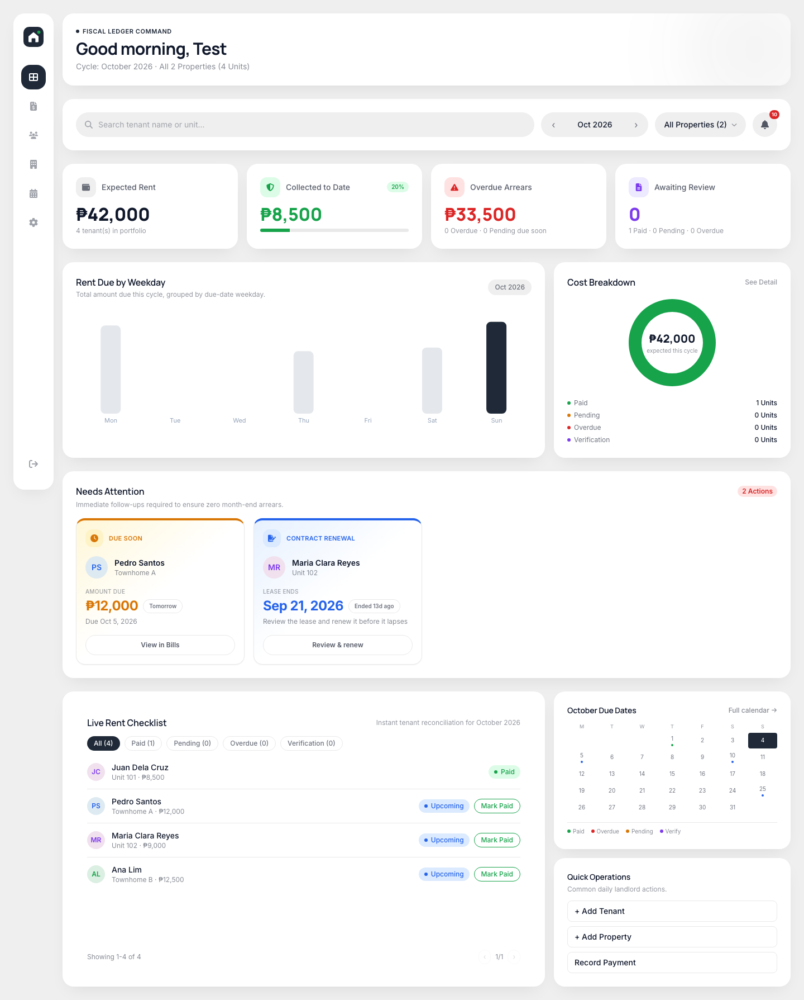
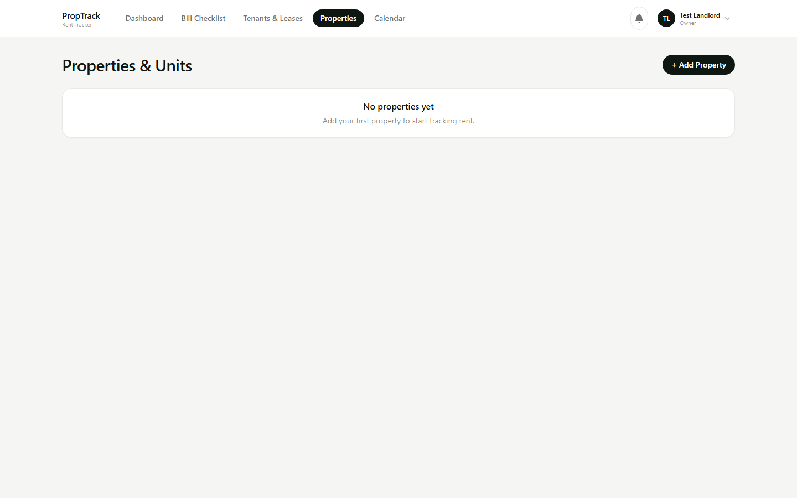
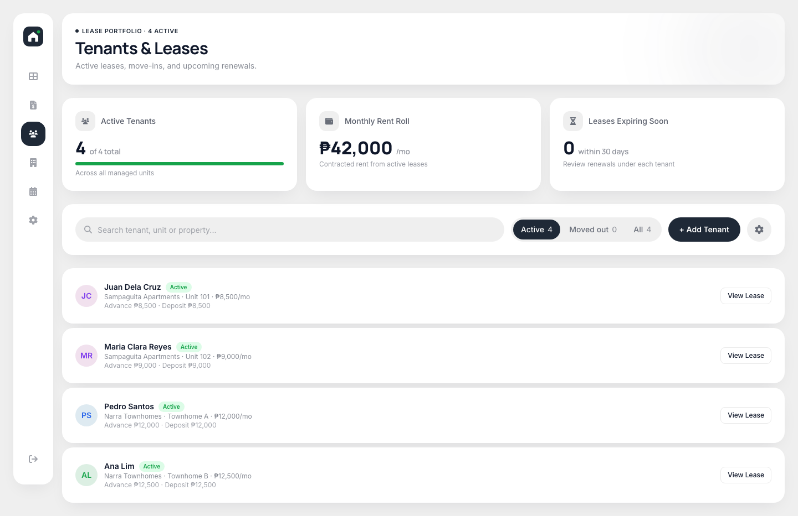
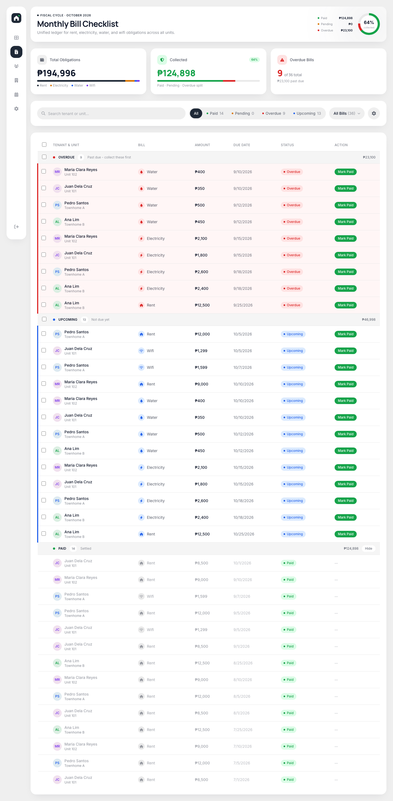
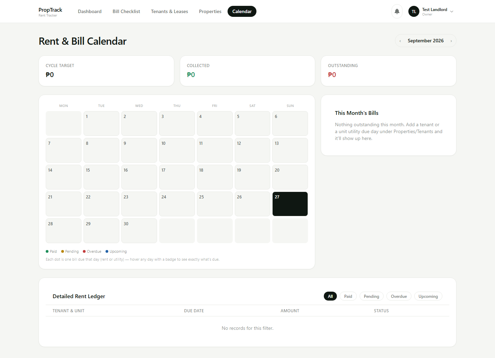
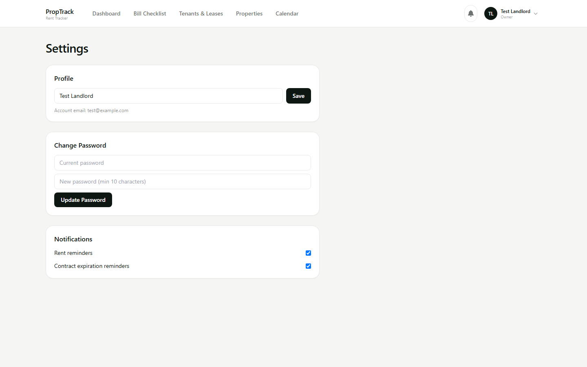
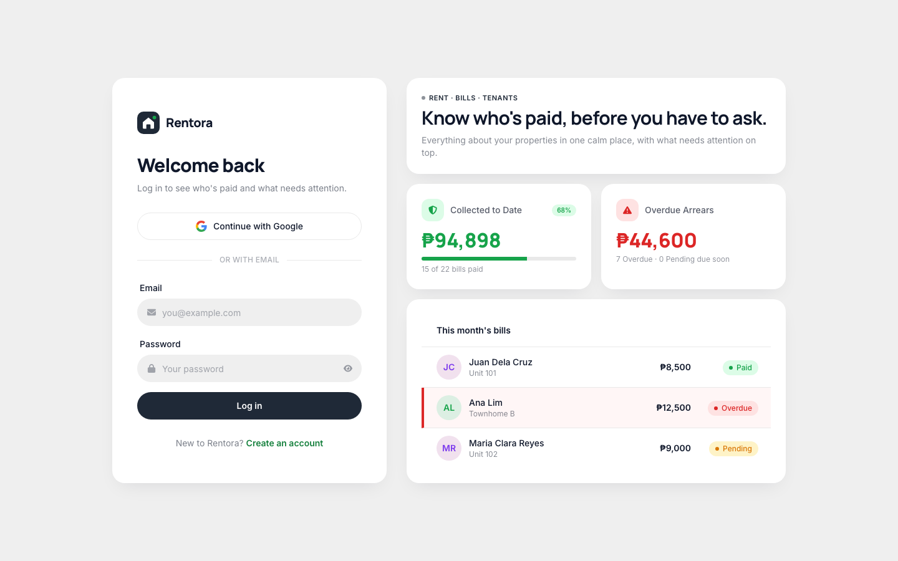
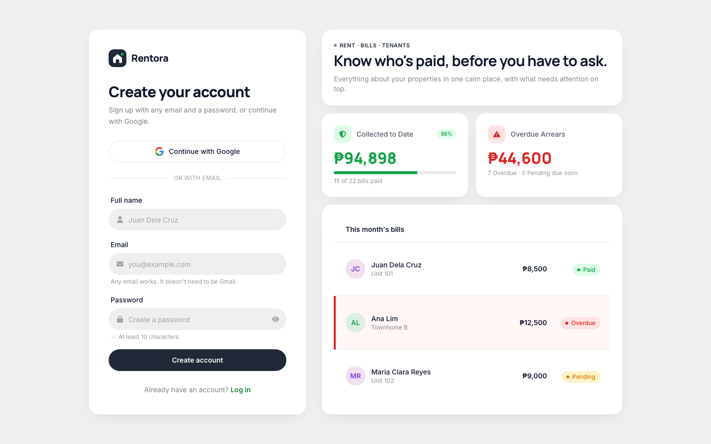

# Rentora - Landlord Rent Tracker

## My project repository

Public repository: https://github.com/Kian-James/Landlord-Rent-Tracking-App

Live app: https://kian-james.github.io/Landlord-Rent-Tracking-App/

API: https://YOUR-API.vercel.app/health (NOT PUBLIC)

## What it is

Rentora is a web app for small landlords to track properties, tenants, monthly rent and utility bills in one place, and see at a glance who has paid and who is overdue. A landlord signs in, adds properties and units, moves tenants in on a lease, and the app generates each month's rent and bills, flags what is overdue and reminds them about expiring contracts.

**What it does**

- Sign up and log in with email and password or Google (Supabase Auth)
- Add properties and units, with a monthly rent and optional electricity, water and wifi amounts and due days
- Move a tenant in with a lease, advance rent and security deposit; renew a lease; move a tenant out without losing history
- Generate each month's rent and utility bills and mark them paid
- Dashboard of what is paid, pending and overdue, with contracts about to expire
- Bill checklist and a calendar of everything due, with an Excel export of the ledger for a date range (up to 24 months)
- In-app notifications for overdue rent, overdue bills and expiring contracts
- Settings for your profile name, password and which reminders you get

**Built with:** React, Vite and Tailwind CSS (client); Express on Node 22 (API); Supabase PostgreSQL (data) and Supabase Auth (login). The client is on GitHub Pages, the API on Vercel, the database on Supabase.

## Screenshots

All screenshots use invented demo data from `server/db/seed.sql`.

**Dashboard.** Expected, collected and overdue rent for the month, what needs attention (rent due soon, leases to renew), a live rent checklist and a mini calendar.

**Properties and units.** Each unit shows its monthly rent, utility amounts with due days, and its current tenant.

**Tenants and leases.** Active and moved-out tenants, with advance and deposit per lease.

**Monthly bill checklist.** Rent, electricity, water and wifi in one list, grouped into overdue, upcoming and paid, each with a Mark Paid button.

**Rent and bill calendar.** Every due date in a month, a rent ledger, and an Excel export.

**Settings.** Profile, change password and notification preferences.

**Log in and register.** Email and password or Google.

## How to run it

You need [Node.js](https://nodejs.org) 22 or newer and a free [Supabase](https://supabase.com) project. There is no Firebase and no other service to set up.

**1. The database.** In Supabase, open **SQL Editor**, paste the contents of `server/db/schema.sql` and run it. It creates the ten tables and switches on Row Level Security for each of them.

If the API later fails with `permission denied for schema public`, run this once in the SQL Editor so the server's `service_role` key can use the tables:

    grant usage on schema public to service_role;
    grant all on all tables in schema public to service_role;
    grant all on all sequences in schema public to service_role;
    alter default privileges in schema public grant all on tables to service_role;

**2. Login.** In Supabase, open **Authentication > Providers** and make sure **Email** is enabled. For Google sign-in, enable **Google** and paste in a Google OAuth client ID and secret. Then, under **Authentication > URL Configuration**, add `http://localhost:5173/auth/callback` to the redirect URLs. (If email confirmation is on, new accounts must click the link in their email before logging in.)

**3. Copy your keys** from **Project Settings > API**: the project URL, the `anon` public key and the `service_role` key.

**4. The API.**

    cd server
    npm install
    cp .env.example .env     # fill in SUPABASE_URL and SUPABASE_SERVICE_ROLE_KEY
    npm run dev              # http://localhost:3000

**5. The client, in a second terminal.**

    cd client
    npm install
    cp .env.example .env     # fill in VITE_SUPABASE_URL and VITE_SUPABASE_ANON_KEY
    npm run dev              # http://localhost:5173

Leave `VITE_API_BASE_URL` empty when running locally. The dev server proxies `/api` to `http://localhost:3000`. Open http://localhost:5173, register an account and you are in. Your landlord record is created automatically on first login.

Example `.env` files (placeholders only, never commit real values):

    # server/.env
    SUPABASE_URL=https://YOUR-PROJECT-REF.supabase.co
    SUPABASE_SERVICE_ROLE_KEY=your-service-role-key
    CORS_ORIGINS=http://localhost:5173

    # client/.env
    VITE_SUPABASE_URL=https://YOUR-PROJECT-REF.supabase.co
    VITE_SUPABASE_ANON_KEY=your-anon-key
    VITE_API_BASE_URL=

**Check the API on its own** before blaming the client:

    curl http://localhost:3000/health     # is the process alive
    curl http://localhost:3000/ready      # is the database reachable

**Demo data.** Log in once, then copy your **User UID** from **Supabase > Authentication > Users** (your login email also works). Paste it into the `who` line at the top of `server/db/seed.sql` and run the file in the SQL Editor. It adds two invented properties, six units, four tenants and a few months of rent. Running it again replaces only its own rows.

**Tests.**

    cd server
    npm run wiring-check     # every module imports and the app assembles
    npm run smoke-test       # end-to-end run against the Supabase project in .env

The smoke test replaces Supabase's token check with a fake one, so it needs no real login, but it does write to the database in `.env` and deletes its own rows afterwards. Point it at a development project.

**Page screenshots (optional).** `cd client && npm run screenshots` uses Playwright to capture every page into `client/screenshots/`. Set `TEST_EMAIL` and `TEST_PASSWORD` to a real account to include the logged-in pages.

## Presentation

- Video (public Google Drive link): https://drive.google.com/YOUR-VIDEO-LINK
- Slides (link or PDF): https://YOUR-SLIDES-LINK
- Square image: `docs/assets/square.png` (or a link)

## AI usage

See [AI-USAGE.md](https://github.com/Kian-James/Landlord-Rent-Tracking-App/blob/main/AI-USAGE.md).

## Environment variables

None of these are committed. `.env.example` in each folder lists them with placeholder values.

| Name | Where | What it is |
| --- | --- | --- |
| `SUPABASE_URL` | server | your Supabase project URL |
| `SUPABASE_SERVICE_ROLE_KEY` | server | bypasses Row Level Security. Server only, never in the client |
| `CORS_ORIGINS` | server | comma-separated origins allowed to call the API (default `http://localhost:5173`) |
| `NODE_ENV` | server | `production` on your host |
| `PORT` | server | defaults to 3000 locally; **set by the host** in production |
| `VITE_SUPABASE_URL` | client, at build time | your Supabase project URL |
| `VITE_SUPABASE_ANON_KEY` | client, at build time | the public `anon` key |
| `VITE_API_BASE_URL` | client, at build time | your API's public URL with no trailing slash. Empty locally |
| `VITE_BASE_PATH` | client, at build time | URL base for the built site, e.g. `/Landlord-Rent-Tracking-App/` on GitHub Pages. Defaults to `/` |

Every `VITE_` value is compiled into the built JavaScript and is **public**. The anon key is safe to expose only because Row Level Security is on for every table.

## Deploying

**Client, to GitHub Pages.** Already wired up in `.github/workflows/deploy-pages.yml`.

1. **Settings > Pages > Build and deployment > Source: GitHub Actions.**
2. **Settings > Secrets and variables > Actions > Variables:** add `VITE_API_BASE_URL`, `VITE_SUPABASE_URL` and `VITE_SUPABASE_ANON_KEY`.
3. Push to `main`. The repository must be **public** for Pages on a free account. The build copies `index.html` to `404.html` so deep links such as `/tenants` work on refresh.
4. **Supabase > Authentication > URL Configuration:** add `https://kian-james.github.io/Landlord-Rent-Tracking-App/auth/callback` to the redirect URLs, or Google login is blocked on the live site.

**API, to Vercel.** `server/vercel.json` rewrites every request to `server/api/index.js`, which exports the Express app.

1. Import the repository in Vercel and set the **Root Directory** to `server`.
2. Add `SUPABASE_URL`, `SUPABASE_SERVICE_ROLE_KEY`, `NODE_ENV=production` and `CORS_ORIGINS=https://kian-james.github.io` under **Settings > Environment Variables**. An origin has no path and no trailing slash.
3. Visit `https://YOUR-API.vercel.app/health` to confirm it is up, then `/ready` to confirm the database is reachable.

**Database.** Run `server/db/schema.sql` once in the Supabase SQL Editor. The seed file is for demos only.

## Project structure

    client/          React front end, built by Vite
      src/api/       one axios client that attaches the Supabase access token
      src/context/   login state
      src/lib/       Supabase client, calendar maths, Excel export, caching
      src/pages/     Dashboard, Properties, Tenants, BillChecklist, Calendar, Settings, Login, Register, AuthCallback
      src/components/
      scripts/       page screenshot script
    server/          Express API
      api/           Vercel serverless entry point
      db/            schema.sql and seed.sql
      src/routes/, controllers/, services/, jobs/, middleware/, utils/
      scripts/       wiring check and smoke test
    docs/            planning documents and weekly reports

## Architecture

The browser signs in with Supabase Auth and sends the resulting access token with every API request. The API checks the token with `supabase.auth.getUser`, creates the landlord's record on first sight, and filters every query by that landlord's id. Only the API talks to the database, using the service-role key, so the browser never holds database credentials. Row Level Security is switched on for every table with no policies, so the public anon key can read nothing. The API also uses `helmet`, `hpp`, a rate limit of 600 requests per 15 minutes, a 1 MB body limit, CORS limited to `CORS_ORIGINS`, and `express-validator` on inputs. Receipts and proof of payment are not part of this version; rent is marked paid by the landlord.

    Browser (GitHub Pages) --Bearer token--> Express API (Vercel) --service role--> Supabase PostgreSQL
            |                                       |
            +---------login (Supabase Auth)---------+--verifies token with Supabase Auth

**Scheduled jobs.** `server/src/jobs/scheduler.js` uses `node-cron` to run daily at about 01:00: generate the month's rent and utility bills, refresh paid/overdue statuses and send notifications, and check for expiring contracts. This runs when the API is started with `npm run dev` or `npm start`. **It does not run on Vercel**, because serverless functions have no long-lived process. On Vercel the rent and bills for a month are still generated whenever the calendar, bill checklist or export asks for them, but overdue status refreshes and expiring-contract reminders only happen where the scheduler is running.

## What I would do next

- Run the daily jobs on a host that stays up, or trigger them from a scheduler such as Vercel Cron, so notifications and reminders also work in production
- Add screens for what the API already supports: undoing a paid rent or bill (`mark-unpaid`) and dismissing notifications
- Let tenants send proof of payment, which needs a verification step and file storage that this version leaves out
- Make move-in atomic with a database function. Supabase's client has no multi-table transactions, so the move-in flow currently rolls back by hand if a step fails
- Remove the leftover `verification_status` fields from `rentGenerator.js`

## Author

Kian James - add your link, course and section.

## Licence

MIT, see [LICENSE](LICENSE). Replace `<your name>` in the licence file with your own name.
